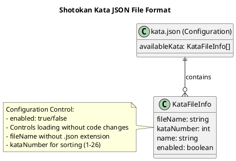
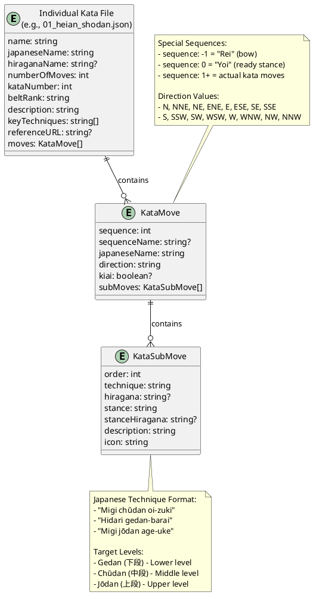

# Shotokan Kata iOS App - Copilot Instructions

## Project Overview
This is a **Shotokan Kata** iOS application built with SwiftUI for iPhone and iPad. The app serves as a quiz and information platform for Shotokan karate practitioners to learn about different kata (forms) in traditional Shotokan karate following the JKA (Japan Karate Association) curriculum.

## Technology Stack
- **Platform**: iOS (iPhone & iPad)
- **Language**: Swift
- **Framework**: SwiftUI
- **Architecture**: MVVM (Model-View-ViewModel)
- **Minimum iOS Version**: iOS 16.0+
- **Internationalization**: Danish (da) and English (en) support
- **iOS 16 Features**: NavigationStack, NavigationSplitView improvements, updated sheet presentations, improved accessibility APIs

## Project Structure
```
Shotokan Kata/
├── Models/             # Data models for kata, questions, ranks
├── Views/              # SwiftUI views and screens
├── ViewModels/         # Business logic and state management
├── Services/           # Data services and kata data loading
├── Resources/          # Localizations, assets, JSON data files
│   ├── kata/           # Individual kata JSON files (numbered)
│   │   ├── 01_heian_shodan.json
│   │   ├── 02_heian_nidan.json
│   │   ├── 05_heian_godan.json
│   │   ├── 06_tekki_shodan.json
│   │   └── 07_bassai_dai.json
│   ├── kata.json       # Configuration file listing all available kata
│   ├── kata_data.json  # Legacy file (replaced by individual files)
│   ├── da.lproj/       # Danish localization
│   └── en.lproj/       # English localization
├── Utils/              # Helper functions and extensions
└── Tests/              # Unit and UI tests
```

## Core Features Implemented

### 1. Kata Information System
- **Kata Database**: Information about traditional Shotokan kata from individual numbered JSON files
- **Configuration-Driven Loading**: `kata.json` file controls which kata are loaded and enabled
- **Individual Kata Files**: Each kata stored in separate numbered files (e.g., `01_heian_shodan.json`)
- **Dynamic Enable/Disable**: Kata can be enabled or disabled via configuration without code changes
- **Rank System**: Comprehensive Kyu and Dan rank progression from 10th Kyu to 10th Dan
- **Kata Details**: Name (English/Japanese/Hiragana), rank, number, moves, key techniques
- **Detailed Technique Specifications**: Complete Japanese technique names with target levels (gedan/chudan/jodan)
- **Authentic Terminology**: Proper Japanese naming conventions with hiragana pronunciation guides
- **Movement Details**: Detailed breakdown with Japanese techniques, stances, directions, and kiai points
- **Japanese-First Move Display**: Shows Japanese technique names and hiragana from first sub-move (no English names)
- **Search & Filter**: By rank, kata number, or techniques used

### 2. Kata Move Display System
- **Japanese-Focused Interface**: Move lists display only Japanese technique names and hiragana spelling
- **Detailed Technique Names**: Complete specifications including target levels (e.g., "Migi chudan oi-zuki")
- **Target Level Integration**: All techniques properly specify gedan (lower), chudan (middle), or jodan (upper) levels
- **First Sub-Move Technique**: Each move row shows the technique name from the first sub-move in the header
- **Multiple Sub-Move Support**: When a move has multiple sub-moves, all additional sub-moves are displayed below the main header
- **Hiragana Support**: Displays hiragana spelling when available for better pronunciation learning
- **Progressive Disclosure**: Single sub-moves display compactly; multiple sub-moves show full detail with proper indentation
- **Sequence Numbering**: Clear numerical indicators for each move in the kata sequence
- **Direction & Kiai Indicators**: Visual cues for movement direction and kiai (shout) points
- **Fallback Display**: Shows move's Japanese name if no sub-moves are available

### 3. Quiz System
- **Rank-Based**: Questions appropriate for specific Kyu and Dan ranks (not belt-based)
- **Multiple Categories**: History, techniques, sequences, applications, ranks, kata order, terminology, philosophy
- **No Progress Tracking**: Clean implementation ready for future progress features
- **Question Types**: Multiple choice with explanations and related kata information

### 4. User Interface
- **Adaptive Design**: Works seamlessly on iPhone (TabView) and iPad (NavigationSplitView)
- **Rank Visual System**: Color-coded rank badges with authentic belt colors
- **Dark/Light Mode**: Support for system appearance preferences
- **Accessibility**: VoiceOver support, Dynamic Type, proper contrast

## Kata Data Standards & Requirements

### JSON File Format Structure

The Shotokan Kata app uses a two-tier JSON file system with a configuration file and individual kata files. Below are the complete structure diagrams:





### Data Validation Standards
- **Authentic Terminology**: Only use verified Japanese martial arts terminology
- **Consistent Formatting**: Follow established naming patterns across all kata
- **Hiragana Accuracy**: Ensure correct hiragana spelling for pronunciation
- **Reference URLs**: Include links to authoritative sources when available
- **Rank Progression**: Maintain proper JKA curriculum rank assignments

## Rank System (Complete Implementation)

### Supported Karate Ranks
```swift
enum KarateRank: String, CaseIterable, Codable {
    // Kyu ranks (colored belts) - descending order
    case tenthKyu = "10_kyu"     // White Belt
    case ninthKyu = "9_kyu"      // Yellow Belt
    case eighthKyu = "8_kyu"     // Orange Belt
    case seventhKyu = "7_kyu"    // Green Belt
    case sixthKyu = "6_kyu"      // Purple Belt
    case fifthKyu = "5_kyu"      // Brown Belt
    case fourthKyu = "4_kyu"     // Brown Belt
    case thirdKyu = "3_kyu"      // Brown Belt
    case secondKyu = "2_kyu"     // Brown Belt
    case firstKyu = "1_kyu"      // Brown Belt
    
    // Dan ranks (black belts) - ascending order
    case firstDan = "1_dan"      // 1st Dan Black Belt
    case secondDan = "2_dan"     // 2nd Dan Black Belt
    case thirdDan = "3_dan"      // 3rd Dan Black Belt
    case fourthDan = "4_dan"     // 4th Dan Black Belt
    case fifthDan = "5_dan"      // 5th Dan Black Belt
    case sixthDan = "6_dan"      // 6th Dan Black Belt
    case seventhDan = "7_dan"    // 7th Dan Black Belt
    case eighthDan = "8_dan"     // 8th Dan Black Belt
    case ninthDan = "9_dan"      // 9th Dan Black Belt
    case tenthDan = "10_dan"     // 10th Dan Black Belt
}
```

### Complete Shotokan Kata Curriculum (Target: 26 Kata)
The app is designed to include all traditional JKA Shotokan kata as defined in the kata.json configuration file:

**Basic Kata (1-5):**
- 01_heian_shodan (9th Kyu - Yellow Belt) ✅
- 02_heian_nidan (8th Kyu - Orange Belt) ✅  
- 03_heian_sandan (7th Kyu - Green Belt) - *To be added*
- 04_heian_yondan (7th Kyu - Green Belt) - *To be added*
- 05_heian_godan (6th Kyu - Purple Belt) ✅

**Intermediate Kata (6-12):**
- 06_tekki_shodan (5th Kyu - Brown Belt) ✅
- 07_bassai_dai (1st Dan Black Belt) ✅
- 08_bassai_sho - *To be added*
- 09_kanku_dai - *To be added*
- 10_kanku_sho - *To be added*
- 11_tekki_nidan - *To be added*
- 12_tekki_sandan - *To be added*

**Advanced Kata (13-26):**
- 13_empi - *To be added*
- 14_hangetsu - *To be added*
- 15_jitte - *To be added*
- 16_gankaku - *To be added*
- 17_nijushiho - *To be added*
- 18_gojushiho_sho - *To be added*
- 19_gojushiho_dai - *To be added*
- 20_unsu - *To be added*
- 21_sochin - *To be added*
- 22_meikyo - *To be added*
- 23_chinte - *To be added*
- 24_wankan - *To be added*
- 25_jiin - *To be added*
- 26_jion - *To be added*

**Current Status:** 0 of 26 kata implemented
**File Structure:** Individual numbered JSON files (01-26) with .json extension automatically appended during loading
**Configuration Control:** Each kata can be enabled/disabled via kata.json without code changes

## Navigation Patterns & Requirements

### Critical Navigation Guidelines
The app uses **NavigationStack push navigation** for all detail views. This ensures proper "Back" button behavior and iOS navigation standards.

#### ⚠️ CRITICAL REQUIREMENT: Always Use NavigationLink for Detail Views
- **MUST ALWAYS** use NavigationLink for KataDetailView navigation to ensure "Back" button appears
- **NEVER** use `.sheet()` for KataDetailView or main content views - this creates unwanted "Done" button behavior
- **NEVER** wrap detail views in their own NavigationStack when they're being pushed
- **NEVER** add "Done" buttons to pushed views - use proper back navigation

#### Correct Navigation Patterns

**✅ REQUIRED: NavigationLink for Push Navigation**
```swift
// In KataListView - ALWAYS use this pattern for detail navigation
NavigationLink(destination: KataDetailView(kata: kata)) {
    KataListRowView(kata: kata)
}
```

**✅ REQUIRED: Detail View Structure**
```swift
// KataDetailView - NO NavigationStack wrapper, NO Done button
struct KataDetailView: View {
    let kata: Kata
    
    var body: some View {
        VStack {
            // Content here
        }
        .navigationBarTitleDisplayMode(.inline) // This is fine
        // NO .toolbar with Done button
        // NO NavigationStack wrapper
    }
}
```

**❌ FORBIDDEN: Modal Sheet Navigation for Main Content**
```swift
// NEVER do this for main content navigation:
.sheet(isPresented: $showingKataDetail) {
    KataDetailView(kata: kata) // This creates "Done" button behavior
}
```

#### When to Use Sheets vs Push Navigation
- **Use NavigationLink + Push**: Main content flow (kata details, quiz views)
- **Use .sheet()**: Settings, filters, secondary actions that should be dismissible

#### Navigation Testing Checklist
When implementing navigation:
- [ ] Detail views show "Back" button (not "Done")
- [ ] Swipe-to-go-back gesture works on iOS
- [ ] Navigation bar title animates correctly
- [ ] No double navigation bars
- [ ] Proper navigation hierarchy maintained

## Internationalization Guidelines

### Localization Strategy
- Use `NSLocalizedString` for all user-facing text
- Create `.strings` files for Danish (`da.lproj`) and English (`en.lproj`)
- Consider cultural differences in color choices and layout
- Test with longer Danish text (typically 20-30% longer than English)

### Key Localization Areas
- **UI Text**: Buttons, labels, navigation titles, rank names
- **Content**: Kata descriptions, quiz questions, help text
- **Error Messages**: User-friendly localized error messages
- **Numbers & Dates**: Use locale-appropriate formatting

## Code Style & Best Practices

### Swift Coding Standards
- Follow Swift API Design Guidelines
- Use meaningful variable and function names
- Prefer `struct` over `class` for value types
- Use `@StateObject`, `@ObservedObject`, and `@Published` appropriately
- Implement proper error handling with `Result` types

### SwiftUI Best Practices
- Keep views small and focused
- Extract complex views into separate files
- Use view modifiers for reusable styling
- Implement proper state management
- Use `@Environment` for shared data

### Data Management
- **Primary Data Source**: Individual numbered kata JSON files in `/Resources/kata/` directory
- **Configuration-Driven**: `kata.json` file controls which kata files are loaded by the application
- **File Structure**: Each kata stored in separate numbered files with consistent naming (01-26)
- **File Loading**: KataDataService automatically appends .json extension when loading files
- **Current Files**: `01_heian_shodan.json`, `02_heian_nidan.json`, `05_heian_godan.json`, `06_tekki_shodan.json`, `07_bassai_dai.json`
- **Target**: All 26 traditional JKA Shotokan kata with complete move sequences
- **Enable/Disable Control**: Kata can be enabled or disabled via `kata.json` without code changes
- **Scalability**: Designed to handle the full 26-kata curriculum without performance issues
- **Local Storage**: UserDefaults for simple preferences
- **No Progress Tracking**: Current implementation focuses on learning without tracking
- **Offline-First**: All kata data is bundled with the app

## File Naming Conventions
- **Views**: `KataListView.swift`, `QuizView.swift`, `KataDetailView.swift`
- **ViewModels**: `KataListViewModel.swift`, `QuizViewModel.swift`
- **Models**: `Kata.swift`, `QuizQuestion.swift`, `DifficultyLevel.swift` (contains KarateRank enum)
- **Services**: `KataDataService.swift`, `QuizDataService.swift`
- **JSON Files**: `01_kata_name.json` through `26_kata_name.json` (numbered with leading zeros)

## Testing Strategy
- **Unit Tests**: ViewModels, services, and utility functions
- **UI Tests**: Critical user flows (taking quiz, viewing kata)
- **Localization Tests**: Verify all strings are localized
- **Accessibility Tests**: VoiceOver and Dynamic Type support

## Dependencies & Frameworks
- **Core Frameworks**: SwiftUI, Combine, Foundation
- **Data Parsing**: JSONDecoder for individual kata JSON files
- **UI Framework**: SwiftUI with TabView (iPhone) and NavigationSplitView (iPad)
- **Testing**: XCTest for unit and UI tests

## Data Model Examples

### Kata Model
```swift
struct Kata: Identifiable, Codable, Hashable {
    let id = UUID()
    let name: String
    let japaneseName: String
    let hiraganaName: String?
    let numberOfMoves: Int
    let kataNumber: Int
    let beltRank: String // Raw string from JSON (e.g., "9_kyu", "1_dan")
    let description: String
    let keyTechniques: [String]
    let referenceURL: String?
    let moves: [KataMove]
    
    // Computed property to convert string to KarateRank enum
    var rank: KarateRank? {
        KarateRank(rawValue: beltRank)
    }
}
```

### Kata Move Model
```swift
struct KataMove: Identifiable, Codable, Hashable {
    let sequence: Int
    let japaneseName: String
    let direction: String // N, NNE, NE, ENE, E, ESE, SE, SSE, S, SSW, SW, WSW, W, WNW, NW, NNW
    let kiai: Bool? // Default: false
    let subMoves: [KataSubMove]
}
```

### Kata Sub-Move Model
```swift
struct KataSubMove: Identifiable, Codable, Hashable {
    let order: Int
    let technique: String          // Detailed Japanese name (e.g., "Migi chudan oi-zuki")
    let hiragana: String?          // Pronunciation guide (e.g., "みぎ ちゅうだん おいづき")
    let stance: String             // Japanese stance name (e.g., "Zenkutsu-dachi")
    let stanceHiragana: String?    // Pronunciation guide for stance
    let description: String        // Detailed movement description
    let icon: String              // SF Symbols icon name
}
```

### Quiz Question Model (Rank-Based)
```swift
struct QuizQuestion: Identifiable, Codable {
    let id = UUID()
    let question: String
    let options: [String]
    let correctAnswerIndex: Int
    let category: QuestionCategory
    let requiredRank: String // Rank requirement (e.g., "9_kyu", "1_dan")
    let explanation: String?
    let relatedKataNames: [String]?
    
    // Computed property to convert string to KarateRank enum
    var rank: KarateRank? {
        KarateRank(rawValue: requiredRank)
    }
}
```

### Kata Configuration Model
```swift
struct KataConfiguration: Codable {
    let availableKata: [KataFileInfo]
}

struct KataFileInfo: Codable, Identifiable {
    let id = UUID()
    let fileName: String        // Without .json extension
    let kataNumber: Int
    let name: String
    let enabled: Bool          // Control visibility without code changes
}
```

## Current App Structure

### Main Views
- **KataListView**: List-based kata browser with rank filtering and numerical sorting
- **KataDetailView**: Three-tab interface (Overview, Moves, History) with detailed kata information
- **QuizMenuView**: Rank selection and quiz customization
- **QuizView**: Quiz interface with progress indicators and results

### Navigation Structure
- **iPhone**: TabView with Kata and Quiz tabs
- **iPad**: NavigationSplitView with sidebar navigation

### Key Components
- **Rank Badges**: Visual indicators with authentic belt colors
- **Kata List Rows**: Information rows showing kata number, rank, names, and basic stats
- **Quiz Categories**: History, techniques, sequences, applications, ranks, kata order, terminology, philosophy
- **Search & Filter**: Real-time filtering by rank, search terms, or difficulty levels

## UI Layout Documentation

### KataHeaderView Visual Structure

The KataHeaderView displays kata information in a structured layout with authentic Japanese terminology and visual rank indicators:

```
┌─ KataHeaderView ────���────────────────────────┐
│                                                │
│  #1  へいあん しょだん (平安初段)       ●  9th Kyu │
│                                                │
│  ┌─────────┐           Kiai on moves 9 and 17. │
│  │ Moves   │                                   │
│  │   21    │                                   │
│  └─────────┘                                   │
└────────────────────────────────────────────────┘
```

#### Visual Design Elements
- **English Name**: Large title2 font weight bold (top left)
- **Japanese Name**: Title3 font with secondary color (middle left)
- **Hiragana**: Caption font with secondary color (bottom left)
- **Rank Badge**: Colored circle indicator with rank text (top right)
- **Kata Number**: Capsule badge with "#N" format (bottom right)
- **Info Chips**: Two rounded rectangle chips showing moves count and rank
- **Background**: System gray6 background with padding
- **Layout**: VStack with 12pt spacing, HStack for horizontal alignment

## Kata Move Display Visual Structure

The move display system uses a progressive disclosure approach that adapts based on the complexity of each move:

### Single Sub-Move Display (Compact)
```
┌─ Move Card ─────────────────────────┐
│ [Seq] Japanese Technique Name         │
│     ひらがな (hiragana)     [KIAI!]  │ 
│     [Stance, たち]             N (^) │
│     Description                  ▼  │
│     (expandable description text)   │
└─────────────────────────────────────┘
```
where "N" indicates direction (North, Nort West, West, etc.) and "(^)" indicates direction using an arrow.

### Multiple Sub-Move Display (Expanded)
```
┌─ Move Card ──────────────────────────────┐
│ [Seq] First Technique Name (Header)        │
│     ひらがな (hiragana)          [KIAI!]  │ 
│     [Stance, たち]                  N (^) │
│     Description                       ▼  │
│     (expandable description text)        │
│                                          │
│     ┌─ Sub-Move 2 ────────────────────┐  │
│     │ [icon] Second Technique         │  │
│     │        ひらがな                  │  │
│     │        [Stance, たち]            │  │
│     │        Description           ▼  │  │
│     │        (expandable text)        │  │
│     └────────────────────────────────┘  │
│                                          │
│     ┌─ Sub-Move 3 ────────────────────┐  │
│     │ [icon] Third Technique          │  │
│     │        ひらがな                  │  │
│     │        [Stance, たち]            │  │
│     │        Description           ▼  │  │
│     │        (expandable text)        │  │
│     └────────────────────────────────┘  │
└──────────────────────────────────────────┘
```
where "N" indicates direction (North, Nort West, West, etc.) and "(^)" indicates direction using an arrow.

### Visual Design Elements
- **Sequence Number**: Blue circular badge with white number
- **Main Header**: Japanese technique name in body font, hiragana in caption
- **Sub-Move Cards**: Nested cards with 42pt left indentation for proper alignment
- **Icons**: System icons representing technique types (e.g., shield for blocks)
- **Color-Coded Badges**: Green for stance
- **Kiai Indicator**: Red badge with "KIAI!" text when applicable
- **Direction**: Secondary text showing movement direction (North, South, etc.)
- **Expandable Descriptions**: Collapsible sections with chevron indicators (▼ collapsed, ▲ expanded)
- **Smooth Animations**: 0.1-second ease-in-out transitions when expanding/collapsing

### Expandable Description Features
- **Toggle Button**: Taps on "Description" row expand/collapse the content
- **Chevron Indicators**: Visual cues showing current state (down arrow = collapsed, up arrow = expanded)
- **Independent State**: Each description (main move and sub-moves) can be expanded independently
- **Default State**: All descriptions start collapsed for clean initial presentation
- **Animations**: Smooth opacity and slide transitions when content appears/disappears


## Accessibility Requirements
- Support VoiceOver with descriptive labels
- Implement Dynamic Type for scalable text
- Ensure minimum 44pt touch targets
- Provide alternative text for images
- Use semantic colors that adapt to accessibility settings
- Rank badges include proper contrast ratios

## Performance Considerations
- Lazy loading for kata lists with LazyVStack
- Efficient JSON parsing and caching from individual files
- Debounced search with 300ms delay
- Minimal view re-renders with proper state management
- Configuration-driven loading for optimal performance

## Security & Privacy
- No personal data collection
- No user progress tracking (by design)
- All data stored locally in app bundle
- Privacy-focused design with minimal data usage

## Kata Data Source
- **Primary Source**: Individual numbered kata JSON files in `/Resources/kata/` directory
- **Configuration File**: `kata.json` controls which kata files are loaded and enabled
- **File Structure**: Each kata stored in separate numbered files (01-26)
- **Automatic Extension**: KataDataService automatically appends .json when loading files
- **Current Files**: 5 of 26 kata implemented
- **Configuration Format**: JSON array with fileName, kataNumber, name, and enabled flag
- **Dynamic Control**: Kata can be enabled/disabled by changing the "enabled" flag in `kata.json`
- **Reference**: Based on traditional Shotokan kata following JKA curriculum
- **Format**: JSON with complete kata information including moves, techniques, and rank requirements
- **Maintenance**: Updates require app release (intentional for accuracy)
- **Legacy**: `kata_data.json` file replaced by individual files for better organization and scalability

## Development Workflow
- Use feature branches for new functionality
- Write tests before implementing features (TDD when possible)
- Regular code reviews focusing on SwiftUI best practices
- Continuous localization testing
- Respect for martial arts authenticity and tradition

## Notes for Copilot
- Always consider both iPhone and iPad layouts when creating views
- Include localization strings for any new user-facing text
- Follow MVVM pattern consistently
- Use KarateRank enum for rank-based systems (not belt-based)
- **Quiz system is RANK-BASED, not belt-based**: Different ranks can share the same belt color but have different requirements
- Prioritize accessibility in all UI implementations
- **Kata data comes from individual numbered JSON files**: Each kata is stored separately for better organization
- **KataDataService handles file extensions**: No need to include .json in configuration file names
- **Configuration-driven loading**: kata.json controls which files are loaded and enabled
- **Kata display format**: Use list-based layout with LazyVStack, sorted by kata number (not grid-based)
- **Kata sorting**: Always display kata sorted by kataNumber in ascending order (1, 2, 5, 6, 7, etc.)
- **Move display implementation**: KataMoveRowView shows Japanese technique names and hiragana from first sub-move in header
- **Multiple sub-move support**: When move.subMoves.count > 1, display additional sub-moves below header with 42pt indentation
- **Progressive disclosure**: Single sub-moves display compactly; multiple sub-moves show full detail automatically
- **Japanese-first approach**: No English technique names displayed in move lists - focus on authentic terminology
- **Detailed technique specifications**: Always use complete Japanese names with target levels (e.g., "Migi chudan oi-zuki")
- **Hiragana pronunciation support**: Display hiragana when available to aid pronunciation learning
- **Sub-move hierarchy**: Each KataMove contains array of KataSubMove objects with detailed technique information
- **Visual structure**: Use nested cards for sub-moves with proper indentation and existing KataSubMoveView component
- **Target level consistency**: Ensure all similar techniques use consistent target level specifications across kata files
- **Authentication priority**: Verify all Japanese terminology against authoritative JKA sources
- No progress tracking implementation (removed by design)
- Maintain authentic Shotokan karate terminology and rank progression
- Use proper Japanese terminology with hiragana when available
- Test with both Danish and English locales
- Rank visual system should use authentic colors with proper contrast
- **Target: 26 total kata**: App designed to eventually include all traditional JKA Shotokan kata
- **Heian Shodan Reference Model**: Use 01_heian_shodan.json as the template for detailed technique specifications in other kata files
- When adding new kata, follow the numbered naming convention (01-26) and update kata.json configuration
- **Technique Detail Standard**: All kata should match the level of detail found in the updated Heian Shodan file with complete target level specifications

### Implementation Logic
```swift
// Display first sub-move in header with expandable description
if let firstSubMove = move.subMoves.first {
    // Show technique, hiragana, stance
    
    // Expandable description
    @State private var isMainDescriptionExpanded = false
    Button(action: { 
        withAnimation(.easeInOut(duration: 0.1)) {
            isMainDescriptionExpanded.toggle()
        }
    }) {
        HStack {
            Text("Description")
            Spacer()
            Image(systemName: isMainDescriptionExpanded ? "chevron.up" : "chevron.down")
        }
    }
    
    if isMainDescriptionExpanded {
        Text(firstSubMove.description)
            .transition(.opacity.combined(with: .move(edge: .top)))
    }
}

// Display additional sub-moves if count > 1
if move.subMoves.count > 1 {
    ForEach(move.subMoves.dropFirst()) { subMove in
        KataSubMoveView(subMove: subMove) // Each with own expandable description
    }
}
```


## Kata Data Extraction Guidelines

### When Adding New Kata Files
Follow these requirements for maintaining consistency and authenticity:

**1. Extraction Source Files:**
- **kata_extraction_hints.md**: Contains specific extraction guidelines and methodology for extracting kata moves from HTML sources
- **HTML Source Files**: Individual kata HTML files (e.g., `01_heian_shodan.html`) contain the authentic move sequences
- **Reference Documentation**: Use kata_extraction_hints.md for proper extraction procedures and validation standards

**2. Japanese Technique Naming Standards:**
- Always include target level specifications (gedan/chudan/jodan) when applicable
- Use proper directional indicators (hidari/migi for left/right)
- Follow established terminology conventions from existing kata files
- Verify technique names against authoritative JKA sources
- Consult kata_extraction_hints.md for specific extraction patterns and common technique variations

**3. Required Data Fields:**
- Complete move sequences with proper numbering
- Accurate hiragana pronunciation for all techniques
- Proper stance names in Japanese (Zenkutsu-dachi, Kokutsu-dachi, etc.)
- Direction indicators for movement orientation
- Kiai markers at traditional points
- Appropriate SF Symbols icons for technique types

**4. Data Validation Process:**
- Cross-reference with multiple authoritative sources
- Ensure consistency with existing kata files
- Validate hiragana spelling accuracy
- Verify rank progression follows JKA curriculum
- Test pronunciation guides for clarity
- Follow extraction methodology outlined in kata_extraction_hints.md

**5. Reference Documentation:**
- Include reference URLs to authoritative sources when available
- Document any variations or alternative interpretations
- Maintain links to traditional JKA curriculum resources

### Kata Extraction Tools & Resources
- **Primary Sources**: JKA official documentation, authenticated dojo resources
- **Extraction Guidelines**: kata_extraction_hints.md contains detailed methodology for extracting moves from HTML files
- **Reference Websites**: Verified martial arts websites with accurate technique databases
- **Pronunciation Guides**: Native Japanese speakers or verified linguistic resources for hiragana
- **Video References**: Official JKA demonstration videos for movement verification
